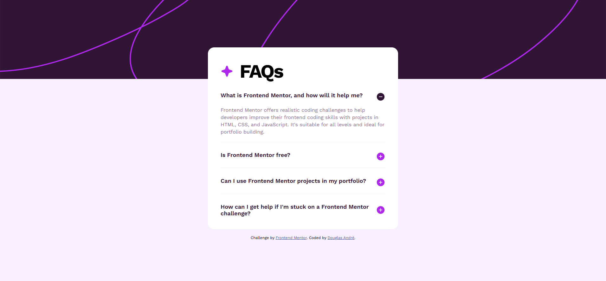
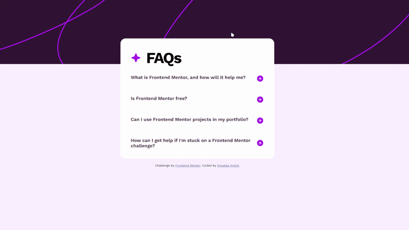

# Frontend Mentor - FAQ Accordion Solution

This is a solution to the [FAQ accordion challenge on Frontend Mentor](https://www.frontendmentor.io/challenges/faq-accordion-wyfFdeBwBz).

## Table of Contents

* [Overview](#overview)

  * [The Challenge](#the-challenge)
  * [Screenshot](#screenshot)
  * [Links](#links)
* [My Process](#my-process)

  * [Built With](#built-with)
  * [What I Learned](#what-i-learned)
  * [Continued Development](#continued-development)
* [Author](#author)

---

# Overview

## The Challenge

Users should be able to:

* Hide/show the answer to each FAQ question when the question is clicked
* Navigate the questions and hide/show answers using keyboard navigation only
* View the optimal layout for the interface depending on their device's screen size
* See hover and focus states for all interactive elements on the page

## Screenshot

## Desktop Preview



## Mobile Preview


## Demo



## Links

* Solution URL: [Frontend Mentor Solution](https://www.frontendmentor.io/solutions/faq-accordion-using-html5-css3-and-vanilla-javascript-yJqRxQD1El)

* Live Site URL: [Live Demo](https://faq-accordion-main-theta-wheat.vercel.app/)

---

# My Process

## Built With

* Semantic HTML5 markup
* CSS custom properties
* Flexbox
* Mobile-first workflow
* Vanilla JavaScript

## What I Learned

This project helped reinforce how to build an accessible accordion component from scratch.

Because the accordion uses native `<button>` elements, users can also navigate and interact with the component using keyboard controls such as `Tab`, `Enter`, and `Space` without requiring additional JavaScript keyboard handling.

One of the biggest takeaways from this project was feeling more confident manipulating the DOM and thinking about component state in JavaScript.

Key highlights include:

### Smooth accordion animations using `max-height`

Instead of measuring element height with JavaScript, I used a CSS-only transition approach:

```css
.accBody {
  max-height: 0;
  overflow-y: hidden;
  transition: max-height 0.5s ease, padding 0.5s ease;
}

.item.opened .accBody {
  max-height: 100vh;
  padding-top: 1.5rem;
}
```

### Improving accessibility with ARIA attributes

I used `aria-expanded` to communicate the accordion state to assistive technologies:

```javascript
clickedItem.querySelector('.title').setAttribute('aria-expanded', 'true');
```

### Managing accordion state

To keep only one item open at a time, I looped through all accordion items and reset their state before opening the clicked item:

```javascript
for (let item of faqItems) {
  item.classList.remove('opened');
  item.querySelector('.title img').src = './assets/images/icon-plus.svg';
  item.querySelector('.title').setAttribute('aria-expanded', 'false');
}
```

## Continued Development

In future projects I'd like to explore:

* Using native HTML approaches (`<details>` / `<summary>`) for accordion behavior
* Animating height with the Web Animations API for more precise control
* Adding reduced-motion support via `prefers-reduced-motion`

---

# Author

* GitHub - [@douglas-andre](https://github.com/douglas-andre)
* Frontend Mentor - [@douglas-andre](https://www.frontendmentor.io/profile/douglas-andre)
